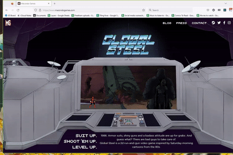

  

<h1 align="center">
  Macondo Games website
</h1>

This is the code for the website of my company Macondo Games. It is live on https://www.macondogames.com/. 

I have made it public to mostly act as a code portfolio. All code and assets are property of Macondo Games Pvt. Ltd. 

## Overview

This site is for my company Macondo Games and our first title - [Global Steel](https://store.steampowered.com/app/1073970/Global_Steel/). The site consists of two pages - a home page built in `Gatsby` housing a carousel with game screenshots and a press page built using [presskit.html](https://github.com/pixelnest/presskit.html) which is itself an SSG generating version of [presskit()](http://dopresskit.com/).

The homepage has CSS powered animations, image optimization using `gatsby-plugin-image`, a loader which uses `gatsby-source-filesystem` etc. Using event listeners I have ensured no matter the dimensions of the window, the screenshots always fit in the monitor.

  

## Testing
**Unit testing**

Unit and integration tests have been done for all the components. `gatsby-plugin-image` is mocked using `Jest` and `@testing-library/react` presenting simple `img` elements with an `alt` attribute so that they are present in the DOM during the tests. `GraphQL` queries are mocked by spying on `useStaticQuery` and returning objects with the same shape as the real data - This is based on the [official docs](https://www.gatsbyjs.com/docs/how-to/testing/testing-components-with-graphql/).

**e2e testing**

Three simple e2e tests are present using `cypress` extended with `@testing-library/cypress`. A test for accessibility using `cypress-axe` and `axe-core` is present along with tests for the carousel on the home page as well as the generated press-kit page.

## Deployment

Deployed on an AWS S3 bucket served via Cloudfront. Github Actions is used for CI. Two websites corresponding to production and development. https://www.macondogames.com/ and https://dev.macondogames.com/ respectively. All tests are integrated into the build process.

